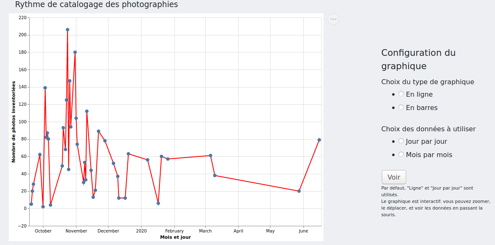
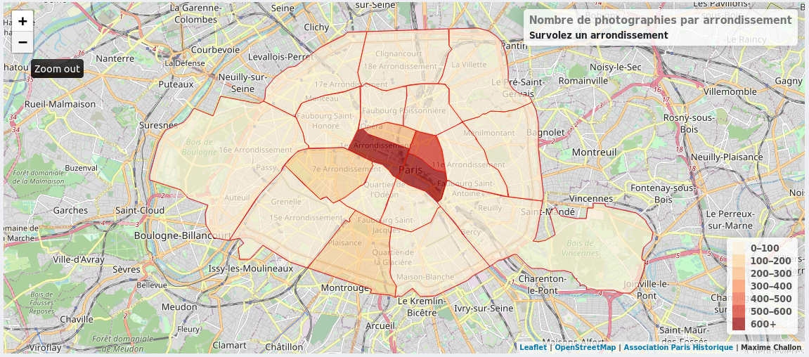
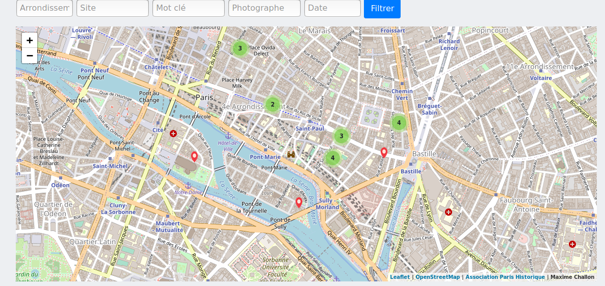

1. [L\'inventaire](#linventaire)
2. [Site de l\'inventaire](#site-de-linventaire)
    * [Mon compte](#mon-compte)
        * [Comment me connecter et me déconnecter de mon compte?](#comment-me-connecter-et-me-déconnecter-de-mon-compte)
        * [Je souhaite changer de mot de passe, est-ce possible?](#je-souhaite-changer-de-mot-de-passe-est-ce-possible)
        * [J'ai changé d'adresse e-mail, comment la modifier dans mon compte?](#jai-changé-dadresse-e-mail-comment-la-modifier-dans-mon-compte)
        * [À quoi servent mes informations personnelles?](#à-quoi-servent-mes-informations-personnelles)
    * [Effectuer l'inventaire](#effectuer-linventaire)
        * [Où puis-je rentrer les informations sur une photographie?](#où-puis-je-rentrer-les-informations-sur-une-photographie)
        * [Quelles sont les informations obligatoires, et celles optionelles?](#quelles-sont-les-informations-obligatoires-et-celles-optionelles)
        * [Je ne trouve pas la rue, la ville, le site, ou toute autre information, dans les menus déroulants, comment puis-je faire?](#je-ne-trouve-pas-la-rue-la-ville-le-site-ou-toute-autre-information-dans-les-menus-déroulants-comment-puis-je-faire)
        * [Les mots-clés sont vraiment importants, j'aimerais connaître comment les utiliser, existe-t-il une documentation spécifique?](#les-mots-clés-sont-vraiment-importants-jaimerais-connaître-comment-les-utiliser-existe-t-il-une-documentation-spécifique)
        * [J'ai enregistré les informations, mais je souhaite les modifier, comment faire?](#jai-enregistré-les-informations-mais-je-souhaite-les-modifier-comment-faire)
        * [J'ai terminé mon lot de photographies, que faire désormais?](#jai-terminé-mon-lot-de-photographies-que-faire-désormais)
    * [Les données de l'inventaire](#les-donnes-de-linventaire)
        * [Quelles visualisations sont disponibles?](#quelles-visualisations-sont-disponibles)
        * [Comment rechercher dans le catalogue?](#comment-rechercher-dans-le-catalogue)
        * [Comment utiliser l'API?](#comment-utiliser-lapi)
    * [Le site renvoie une erreur, est-ce normal?](#le-site-renvoie-une-erreur-est-ce-normal)
3. [Informations globales](#informations-globales)
    * [Qui contacter ?](#qui-contacter)
    * [Puis-je réutiliser les données ou le code source?](#puis-je-rutiliser-les-donnes-ou-le-code-source)


## L'inventaire

## Site de l'inventaire
### Mon compte
#### {:height="25px"}Comment me connecter et me déconnecter de mon compte?

Pour remplir l'inventaire, il est nécessaire de disposer d'un compte. 


Si vous êtes autorisé à participer à l'inventaire, un mot de passe a été envoyé à votre adresse mail. Si vous n'avez pas encore de compte et que vous souhaitez participer, vous pouvez nous contacter [ici](#qui-contacter).


Pour vous **connecter**, il vous suffit alors de cliquer sur [l'onglet "Connexion"](http://parishistoriqueinventaire.eu.pythonanywhere.com/connexion), de rentrer votre nom de famille avec une majuscule au début, puis votre mot de passe.
{:width="750px"}
{:width="750px"}


Pour me **déconnecter**, il suffit de cliquer dans l'onglet "Mon compte" > "Déconnexion".
{:width="750px"}


#### {:height="25px"}Je souhaite changer de mot de passe, est-ce possible?
Bien sûr! Pour cela, rien de plus simple. Il suffit de cliquer sur "Mot de passe oublié?" sur la [page de connexion](http://parishistoriqueinventaire.eu.pythonanywhere.com/connexion).
{:width="750px"}

Remplissez ensuite votre adresse mail, et vous recevrez un e-mail avec un lien (pensez à regarder vos spams), comme l'exemple suivant.
{:width="750px"}


Cliquer sur ce lien va vous permettre de changer votre mot de passe.

{:height="120px"}

#### {:height="25px"}J'ai changé d'adresse e-mail, comment la modifier dans mon compte?

Une page spéciale vous permet de voir et de modifier l'ensemble des informations vous concernant: nom, prénom, et adresse e-mail.
Cette page est disponible à l'adresse [http://parishistoriqueinventaire.eu.pythonanywhere.com/espace_personnel/mon_profil](http://parishistoriqueinventaire.eu.pythonanywhere.com/espace_personnel/mon_profil) ou bien en cliquant dans l'onglet "Mon espace" > "Mon profil".
{:width="750px"}


La page obtenue permet de modifier ses informations personnelles, ainsi que de changer de mot de passe.
Des chiffres personnels sont également disponibles afin de voir le travail réalisé.
{:width="750px"} 

#### {:height="25px"}À quoi servent mes informations personnelles?

Très peu d'informations sont nécessaires à la réalisation de l'inventaire:
* le *nom* et le *prénom* sont insérés dans l'inventaire afin de pouvoir avoir une trace de la personne qui a réalisé l'inventaire de chaque photographie
* le *mail* vous permet de recevoir le lien de modification de votre mot de passe, à tout moment

**Aucune autre information ne vous sera demandée.**

### Effectuer l'inventaire
#### {:height="25px"}Où puis-je rentrer les informations sur une photographie?

Un seul endroit permet d'enregistrer une photographie: [http://parishistoriqueinventaire.eu.pythonanywhere.com/espace_personnel/cataloguer?nom_user=VOTRE_NOM](http://parishistoriqueinventaire.eu.pythonanywhere.com/espace_personnel/cataloguer). Cette page est accessible dans l'onglet "Mon espace" > "Cataloguer".
{:width="750px"}

Vous trouverez sur cette page l'ensemble des informations qu'il est possible de remplir sur une photographie. (Voir [Quelles sont les informations obligatoires, et celles optionelles?](#quelles-sont-les-informations-obligatoires-et-celles-optionelles) pour savoir quelles informations il est absolument nécessaire de rentrer.)
{:width="750px"}

#### {:height="25px"}Quelles sont les informations obligatoires, et celles optionelles?

Le catalogage des photographies est très souple et s'adapte aux photographies que vous avez sous les yeux: ainsi, peu de champs seront bloquants s'ils ne sont pas remplis.

Le **numéro d'inventaire** est absolument nécessaire, tout comme l'un des dix descripteurs de **"Généralité architecture"**. L'ensemble des autres champs peut ne pas être rempli si vous n'avez pas les informations pour le faire.

Cependant, n'oubliez pas que le but de l'inventaire est la description des photographies. S'il peut arriver fréquemment que l'on ne connaissance ni l'adresse ni les informations comme les droits ou le photographe, il est normalement toujours possible de poser au moins un ou deux **mots-clés** puisqu'ils sont décidés en fonction du contenu de la photographie.

Concernant la **localisation GPS**, vous n'êtes pas obligé de chercher la localisation sur la carte. Cependant, si vous le faites, il faut être certain que l'adresse remplie plus haut dans le formulaire corresponde exactement à cette localisation GPS: un traitement automatique se fait plusieurs fois par mois afin de relier toutes les adresses similaires à une seule localisation; la localisation rentrée par le formulaire par vos soins est prioritaire face aux données qui sont normalement rapatriées depuis l'API mise à dispoition par le gouvernement.

Enfin, l'inventaire fonctionne pour une majorité des champs selon des **listes déroulantes** à choix: le but de ces listes est de contraindre à l'utilisation commune de mêmes textes. Ainsi, vous ne pourrez pas indiquer ce que vous souhaitez dans ces champs: seuls certains des champs comme la légende ou les notes le permettent. En effet, plus les données de l'inventaire seront normalisées, plus les photographies pourront être consultées et retrouvées par le lecteur!

#### {:height="25px"}Je ne trouve pas la rue, la ville, le site, ou toute autre information, dans les menus déroulants, comment puis-je faire?

Il arrivera certainement que vous ne trouviez pas le nom d'une rue, d'un site, d'une ville, d'une personne, ou un mot-clé dans les choix proposés. Ne vous en inquiétez pas! Ces listes ne sont pas figées et sont destinées à évoluer selon les besoins que l'on rencontre au cours de l'inventaire. 

Afin que je puisse rajouter le terme dans la liste concernée, vous pouvez me le faire savoir en m'envoyant un mail. 

Sinon, une autre solution est de remplir le formulaire [http://parishistoriqueinventaire.eu.pythonanywhere.com/espace_personnel/cataloguer/contact?nom_user=VOTRE_NOM](http://parishistoriqueinventaire.eu.pythonanywhere.com/espace_personnel/cataloguer/contact) dont le lien est disponible en haut de la page de catalogage. N'oubliez pas d'indiquer le numéro d'inventaire de la photographie qui a besoin de ce nouveau terme, je le rajouterai en même temps dans les informations que vous avez déjà remplies pour ne pas vous faire perdre votre temps!
{:width="750px"}

#### {:height="25px"}Les mots-clés sont vraiment importants, j'aimerais connaître comment les utiliser, existe-t-il une documentation spécifique?

Vous avez raison, les mots-clés et les descripteurs sont le coeur de l'inventaire. Leur liste exhaustive, et la description de leur utilisation, est disponible sur ce lien: [POST A VENIR]().

Si vous ne trouvez pas le mot-clé nécessaire, voir le sujet [Je ne trouve pas la rue, la ville, le site, ou toute autre information, dans les menus déroulants, comment puis-je faire?](#je-ne-trouve-pas-la-rue-la-ville-le-site-ou-toute-autre-information-dans-les-menus-déroulants-comment-puis-je-faire).

#### {:height="25px"}J'ai enregistré les informations, mais je souhaite les modifier, comment faire?

Pour accéder à la modification d'une photographie, il faut se rendre sur la page qui recense tous vos enregistrements récents dans l'onglet "Mon espace" > "Enregistrements récents". Vous arriverez alors sur la page [http://parishistoriqueinventaire.eu.pythonanywhere.com/espace_personnel/enregistrements_recents?nom_user=VOTRE_NOM](http://parishistoriqueinventaire.eu.pythonanywhere.com/espace_personnel/enregistrements_recents).
{:width="750px"}

Cette page des enregistrements récents vous donne un aperçu des photographies inventoriées, et vous permet de les modifier.
{:width="750px"}

En cliquant sur le bouton "Mettre à jour", vous pourrez alors modifier les informations que vous aviez remplies auparavant.
{:width="750px"}

#### {:height="25px"}J'ai terminé mon lot de photographies, que faire désormais?

Afin que je sache qu'il faut rentrer vos photographies dans l'inventaire final, il faut se rendre dans l'onglet ["Mon espace" > "Exporter"](http://parishistoriqueinventaire.eu.pythonanywhere.com/espace_personnel/exporter). Cette page vous demande plusieurs informations:
{:width="750px"}
* dans le premier champ "Numéro de début", il faut rentrer le numéro d'inventaire le plus bas de son lot de photographies
* dans "Numéro de fin", il faut rentrer le numéro d'inventaire le plus haut dans son lot de photographies.
* cocher l'une des deux cases suivantes:
	* si vous souhaitez seulement envoyer les photographies à la photothèque, cochez la première case
	* si vous souhaitez recevoir une copie du mail qui est envoyé à la photothèque, cochez la seconde case "Recevoir une copie"

**Attention**, il peut arriver que votre lot de photographies n'ait pas des numéros qui se suivent. Par exemple, il a les numéros 25 à 30 puis 120 à 125 et 40 à 50. Il n'est pas nécessaire de faire trois envois distincts. Dans ce cas, remplir en numéro de début 25 et en numéro de fin 125, la machine s'occupe ensuite du reste!

Enfin, n'oubliez pas de rapporter le lot de photographies à la photothèque, dans la boîte **"Retours"**, et d'en prendre de nouvelles si vous le souhaitez.

### Les données de l'inventaire
#### {:height="25px"}Quelles visualisations sont disponibles?

L'intérêt de l'inventaire est de pouvoir utiliser les données pour rechercher comme dans un catalogue, ou pour les visualiser de différentes manières. Ainsi, vous trouverez plusieurs visualisations (de nouvelles sont créées au fil des mois, ou des présentes sont mises à jour ou améliorées régulièrement):
* l'onglet "Quelques chiffres" offre des généralités sur l'inventaire {:width="750px"}
	* une visualisation spécifique à l'avancée de l'inventaire est disponible dans l'onglet ["Quelques chiffres" > "Rythme de catalogage"](http://parishistoriqueinventaire.eu.pythonanywhere.com/rythme_catalogage). Vous y trouverez un graphique que vous pouvez construire vous-même pour observer l'avancée de l'inventaire dans le temps.{:width="750px"}
	* dans ce même onglet à ["Répartissement par arrondissement"](http://parishistoriqueinventaire.eu.pythonanywhere.com/graphiques/repartition_arrondissements), vous avez une carte montrant la répartition des photographies inventoriées dans chaque arrondissement {:width="750px"}
* l'onglet ["Cartographie"](http://parishistoriqueinventaire.eu.pythonanywhere.com/cartographie) vous permet de trouver toutes les photographies associées à une localisation GPS. Vous pouvez zommer pour éclater les clusters. Quand le zoom n'est plus possible, cliquez sur les clusters. Des points rouges apparaîtront et vous permettront, en cliquant dessus, d'afficher les informations de la photographie. {:width="750px"}


#### {:height="25px"}Comment rechercher dans le catalogue?

Le [catalogue](http://parishistoriqueinventaire.eu.pythonanywhere.com/catalogue) est encore en cours de construction, il arrive très vite!

#### {:height="25px"}Comment utiliser l'API?

L'[API](http://parishistoriqueinventaire.eu.pythonanywhere.com/api) permet de renvoyer des résultats au format JSON. 
Il y a deux possibilités pour y accéder et récupérer les données:
* Elle est disponible dans l'onglet "Données" > "API". Vous n'avez alors qu'à remplir l'un des quatre formulaires pour obtenir les données. {:width="750px"}
* Elle est accessible via HTTP GET avec l'URL de base "http://parishistoriqueinventaire.eu.pythonanywhere.com/api/photographie/". Une documentation plus poussée sur l'API arrive prochainement [ici]().
	* Ajouter à cette URL de base "numero_inventaire?q=" + NUMERO_INVENTAIRE vous renvoie les informations concernant cette unique photographie.
	* Ajouter à cette URL de base "numeros_inventaire?q=" + NUMEROS_INVENTAIRE_SEPARES_PAR_AUTRE_CHOSE_QU_UN_CHIFFRE vous renvoi toutes les informations pour chacune des photographies comprises dans l'intervalle fourni.
	* Ajouter à cette URL de base "adresse?q=" + ADRESSE vous renvoie l'ensemble des photographies situées à cette adresse.
	* Ajouter à cette URL de base "mot_cle?q=" + MOT_CLE vous renvoie l'ensemble des photographies ayant ce mot-clé dans ses mots-clés.

Structure du JSON renvoyé:
``` json
{"data":[{"numero_inventaire":
		{"Arrondissement":"str",
		"Cote_base":"str",
		"Cote_classement":"str",
		"Couleur":"str",
		"Date_prise_vue":"str",
		"Latitude_x":"str",
		"Longitude_y":"str",
		"Mot_cle1":"str",
		"Mot_cle2":"str",
		"Mot_cle3":"str",
		"Mot_cle4":"str",
		"Mot_cle5":"str",
		"Mot_cle6":"str",
		"N_inventaire":"str",
		"N_rue":"str",
		"Nom_site":"str",
		"Photographe":"str",
		"Rue":"str",
		"Support":"str",
		"Taille":"str",
		"Ville":"str"}
	},],
"links":{
	"next":"str",
	"self":"str"
	},
"meta":{
	"copyright":"str",
	"total results": int}
	}
}
```

### {:height="25px"}Le site renvoie une erreur, est-ce normal?

Non, ce n'est pas normal. Cependant, si l'erreur est 404, c'est que vous avez demandé une page qui n'existe pas. Si l'erreur est dans les 500, il faut vite me [prévenir](#qui-contacter), l'erreur est de mon côté et j'essaierai de la résoudre très vite!

## Informations globales
### {:height="25px"}Qui contacter?

* Pour obtenir plus d'informations sur l'**association du Paris Historique**, 
contacter directement l'association:
    * Site internet: [https://www.paris-historique.org/](https://www.paris-historique.org/)
    * Adresse: 44-46 Rue François Miron, 75004 Paris
    * Téléphone: 01 48 87 74 31
    
* Pour consulter les photographies à la **photothèque**, contacter la phothotèque ou l'association:
    * Page web: [https://www.paris-historique.org/phototheque/](https://www.paris-historique.org/phototheque/)
    * Ouverture du lundi au vendredi de 14h à 18h
    * Téléphone: 01 84 17 26 35
    
* Pour obtenir plus d'informations sur l'**inventaire** de la photothèque, contacter l'association ou le responsable:
    * Association: 
        * Mail: [contact@paris-historique.org](contact@paris-historique.org)
    * Responsable: 
        * Mail: [maxime.challon@gmail.com](maxime.challon@gmail.com)
        
* Pour **participer** à l'inventaire de la photothèque, contacter l'association:
    * Mail: [contact@paris-historique.org](contact@paris-historique.org)
    

### {:height="25px"}Puis-je réutiliser les données ou le code source?

Sauf mention explicite contraire, toutes les données disponibles sur [parishistoriqueinventaire.eu.pythonanywhere.com/](parishistoriqueinventaire.eu.pythonanywhere.com/)
sont réutilisables  et sous license GNU/GPL 3.0 ou ultérieure, de même que le code source du site d'inventaire
disponible sur Github [https://github.com/MaximeChallon/InventaireParisHistorique](https://github.com/MaximeChallon/InventaireParisHistorique/tree/master). Vous êtes libre de proposer des modifications sur ce code source via les *issues* ou les *pull request*.

L'[API](http://parishistoriqueinventaire.eu.pythonanywhere.com/api) permet la récupération des données de l'inventaire formatées en JSON.
